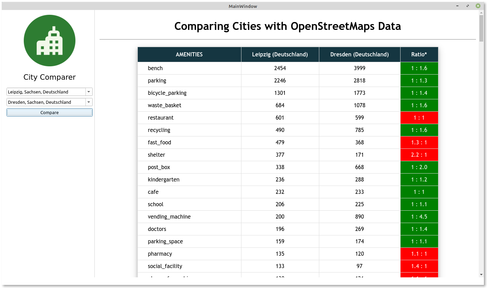

# OSM City Comparer
Small PyQt tool for comparing cities using `OpenStreetMap` data about points of interest (POIs).
Data is requested using `Nominatim` and `overpy`. Project was just a quick test, so not stable and tested.



## Installation
```shell
pip install -r requirements.txt
python3 compare_cities.py
```

## Usage
1. Enter two city names and wait for autocompletion (Optional change selection with dropdown).
2. Click on compare cities and wait for background API calls.